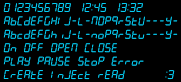

# GE Rapid Clean II (seven-segment display font)

A digital recreation of the font used by the seven-segment display in the General Electric Rapid Clean II stove, because I think it looks neat. More on the [corresponding wiki page](https://wiki.maxthomaslang.de/w/GE_Rapid_Clean_II_(seven-segment_display_font)).

## Preview

## Install

Download the latest version from the wiki page, or open `font/clock.sfd` in FontForge and export.
